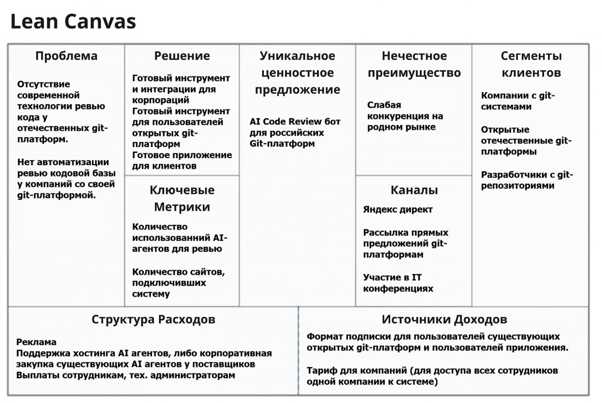
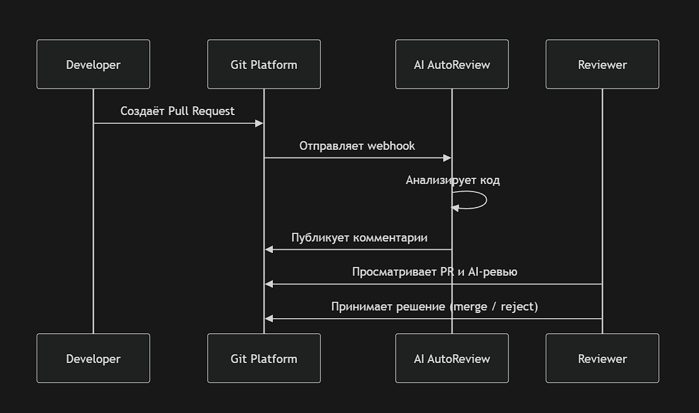
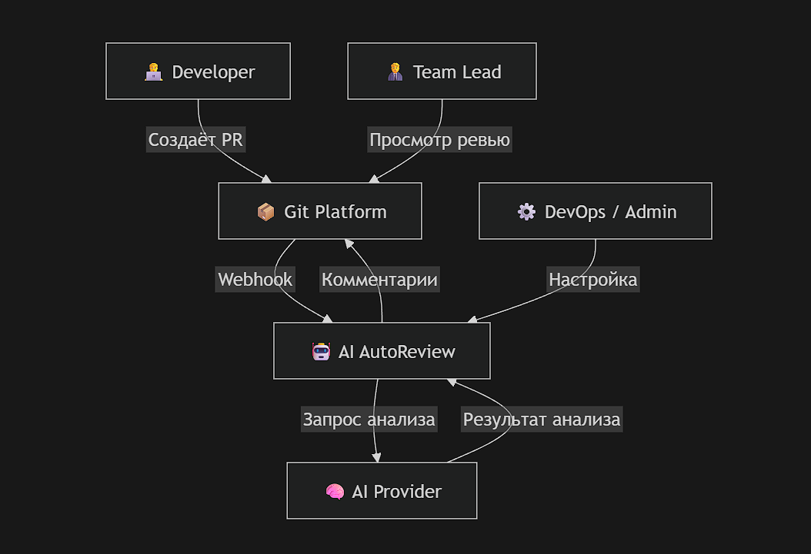
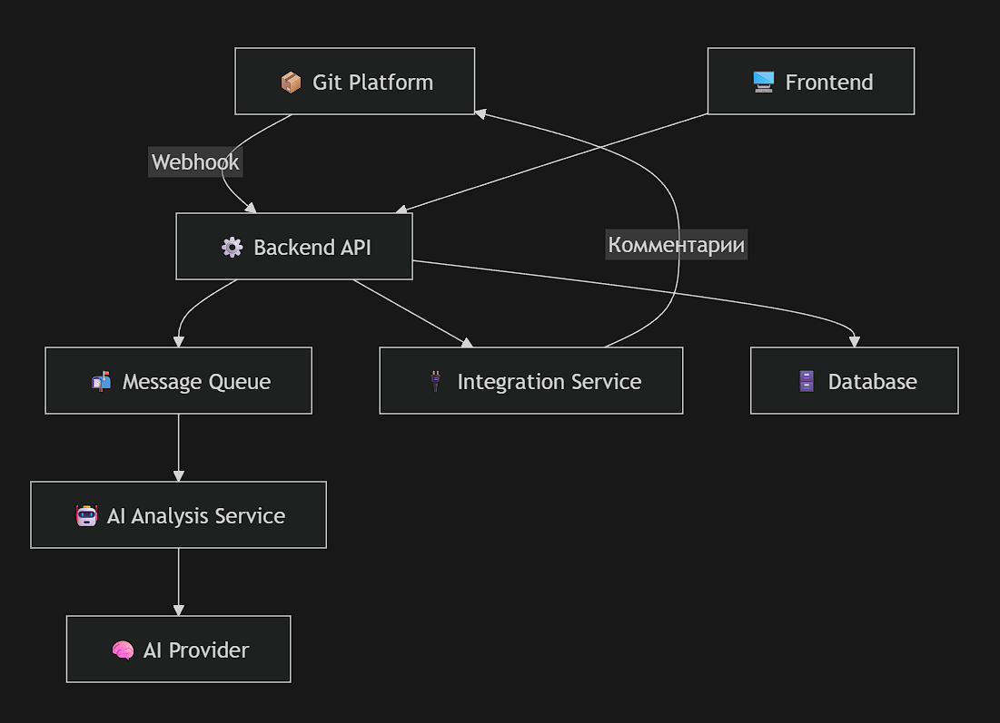

# AI AutoReview
AI Code Review бот для российских Git-платформ (B2B, предлагается внедрять бота в компании git-платформы)


## Elevator Pitch

Интеграция AI, автоматизация Review кода на российских git-платформах.

Одна из задач, которую AI агенты делают наиболее эффективно - ревью существующего кода. На нашем рынке всё ещё не распространено внедрение AI агентов внутри отечественных git-платформ. Мы можем предложить простую интеграциюю такой системы в git-систему любой компании. В итоге компания получает интеграцию с нашей системой, а мы - комиссию за подписку на нашу систему от компании владельца git-системы.

## Lean Canvas



### 1. Сегменты потребителей

Компании, имеющие собственные git-системы внутри своих отделов разработки

Открытые отечественные git-платформы

Разработчики с git-репозиториями

### 2. Проблема

Отсутствие современной технологии ревью кода у отечественных git-платформ.

Неавтоматизированное ревью кодовой базы у компаний со своей git-платформой.

### 3. Уникальная ценность

AI Code Review бот для российских Git-платформ

### 4. Решение

Готовый инструмент и интеграции для корпораций

Готовый инструмент для пользователей открытых git-платформ

Готовое приложение, подвязывающееся по git к репозиторию и анализирующее его

### 5. Каналы

Яндекс директ

Рассылка прямых предложений git-платформам

Участие в межорганизационных конференциях


### 6. Потоки прибыли

Формат подписки для пользователей существующих открытых git-платформ и пользователей приложения.

Тариф для компаний (для доступа всех сотрудников одной компании к системе)

### 7. Структура издержек

Реклама

Поддержка хостинга AI агентов, либо корпоративная закупка существующих AI агентов у поставщиков

Выплаты сотрудникам, тех. администраторам

### 8. Ключевые метрики

Количество использованний AI-агентов для ревью

Количество сайтов, подключивших систему


## Основные роли
Backend-Разработчики - пишет код с бизнес-логикой и связкой с AI-ботами, создаёт pull/merge requests, получает ревью.

UI/UX Designer - проектирует логику пользовательского пути (UX) и отрисовывает визуальный интерфейс (UI).

Fontend-Разработчики - берет проекты дизайнеров и пишет frontend.

Team Lead - Проверяет код, принимает решения по merge, следит за качеством.

DevOps / Администратор Git-платформы - настраивает интеграции, управляет доступами.

## User Stories
### Для разработчиков-клиентов:
Как разработчик, я хочу получать автоматические комментарии к коду, чтобы быстрее находить ошибки.

Как разработчик, я хочу видеть рекомендации по улучшению кода, чтобы писать чище.

Как разработчик, я хочу получать ревью сразу после создания PR, чтобы не ждать человека.

Как разработчик, я хочу видеть уровень критичности замечаний, чтобы понимать приоритет.

Как разработчик, я хочу интеграцию с Git, чтобы не выходить из привычной среды.

### Для тимлидов-клиентов:
Как тимлид, я хочу получать предварительное AI-ревью, чтобы экономить время.

Как тимлид, я хочу фильтровать замечания AI, чтобы видеть только важное.

Как тимлид, я хочу статистику по качеству кода команды, чтобы управлять процессом.

### Для DevOps:
Как администратор, я хочу легко интегрировать бота, чтобы быстро внедрить систему.

Как администратор, я хочу управлять доступами, чтобы контролировать безопасность.

### Для компании:
Как компания, я хочу снизить время ревью кода, чтобы ускорить релизы.

Как компания, я хочу централизованное решение, для автоматического review кода.

### Общие:
Как пользователь, я хочу видеть историю ревью, чтобы отслеживать изменения.

Как пользователь, я хочу настраивать правила анализа, чтобы адаптировать систему под проект.

## Приоритизация функционала (MoSCoW)
### Must Have (обязательно)
Автоматическое ревью PR

Комментарии прямо в Git

Интеграция с Git-платформами

Базовый анализ кода (ошибки, стиль)

### Should Have (желательно)

Классификация критичности

Настройка правил

История ревью

### Could Have (можно позже)

Статистика по команде

Расширенные рекомендации (архитектура)

UI-дэшборд

### Won’t Have (пока не делаем)
Полная замена человека-ревьюера

Deep анализ архитектуры уровня senior## MVP

## MVP
Скелет:

Интеграция с Git (webhook / API)

Анализ pull request

Генерация комментариев

Базовые правила (линтинг + простая логика)

Главная цель: бот уже реально помогает ревьюить код

## MLP
Добавляем "вау":

Умные рекомендации (не только ошибки)

Приоритизация замечаний

Красивый UI/дашборд

Аналитика по проекту

Настройка правил

Цель: пользователи ХОТЯТ этим пользоваться, а не просто могут

## Две главные истории из MVP и требования

1. Автоматическое ревью PR
Функциональные требования:
Система принимает webhook от Git
Анализирует diff PR
Генерирует комментарии
Публикует их в PR
Нефункциональные требования:
Время ответа ≤ 10 секунд
Поддержка ≥ 1000 PR/день
Надёжность (99.5% uptime)
Безопасность (только read-only доступ к коду)

2. Интеграция с Git-платформой
Функциональные требования:
Подключение через API/token
Настройка репозитория
Включение/выключение бота
Поддержка популярных Git-систем
Нефункциональные требования:
Простота установки (≤ 15 минут)
Документация
Масштабируемость
Совместимость с разными версиями Git-серверов

| Раздел              | Содержание |
|--------------------|-----------|
| Роли               | Developer, Team Lead, UI/UX Designer, DevOps |
| Кол-во User Stories| 15 |
| Основная ценность  | Автоматизация code review |
| Must Have          | Авто-ревью, комментарии, интеграция с Git |
| Should Have        | Критичность, история, настройки |
| Could Have         | Аналитика, UI, расширенные рекомендации |
| MVP                | Интеграция + анализ PR + комментарии |
| MLP                | Умные рекомендации + UI + аналитика |
| Ключевая история 1 | Автоматическое ревью PR |
| Ключевая история 2 | Интеграция с Git |
| НФ требования      | Быстродействие, масштабируемость, безопасность |




## Доменные зоны Domain-Driven Design

### Code Analysis Domain

Описание:
Отвечает за анализ кода, поиск ошибок и генерацию рекомендаций.

Глоссарий:
```
Analysis — процесс проверки кода
Issue — найденная проблема
Suggestion — рекомендация по исправлению
Severity — уровень критичности
```
### Integration Domain

Описание:
Интеграция с Git-платформами через API/webhooks.

Глоссарий:
```
Webhook — событие от Git-системы
Repository — репозиторий
Pull Request (PR) — запрос на слияние
Access Token — ключ доступа
```
### Review Management Domain

Описание:
Управление результатами ревью и их отображением.

Глоссарий:
```
Review — результат анализа
Comment — комментарий к коду
Thread — цепочка обсуждений
Status — статус ревью
```
### User & Access Domain

Описание:
Управление пользователями и правами.

Глоссарий:
```
User — пользователь
Role — роль (dev, admin и т.д.)
Permission — разрешение
Organization — компания
```
### Billing Domain

Описание:
Подписки и оплата.

Глоссарий:
```
Subscription — подписка
Plan — тариф
Usage — использование
Invoice — счёт
```

## Behavior-Driven Development - 1 Критический путь MVP
Сценарий успеха

Feature: Автоматическое ревью кода
```
Сценарий: Успешный анализ Pull Request
  разработчик создал Pull Request
  система подключена к Git-платформе
  Git отправляет webhook в систему
  Система анализирует код
  Публикует комментарии в Pull Request
```

Сценарий отказа
```
Сценарий: Ошибка анализа кода
  Разработчик создал Pull Request
  Система получает webhook
  Происходит ошибка анализа
  Система отправляет сообщение об ошибке
  Не публикует комментарии
```
## Wireframes 2 ключевых экрана в приложении
--------------------------------------------------
| Pull Request: feature/login                    |
--------------------------------------------------
| File: file1.java                              |
|                                                |
|  > AI: Possible null pointer (HIGH)            |
|  > AI: Simplify condition (LOW)                |
|                                                |
--------------------------------------------------
| File: file2.java                              |
|                                                |
|  > AI: Unused variable                         |
|                                                |
--------------------------------------------------
| [ Approve ]        [ Request Changes ]         |
--------------------------------------------------

--------------------------------------------------
| Integration Settings                           |
--------------------------------------------------
| Git Platform: [ GitLab ▼ ]                     |
| Repository:   [ my-project ]                   |
| Token:        [ ************* ]                |
|                                                |
| [ Test Connection ]                            |
| [ Enable AI Review ]                           |
--------------------------------------------------
## API-First - JSON REST API для главных ручек

### Анализ PR

POST /analyze

Request:
```json
{
  "repository": "my-project",
  "pr_id": 123,
  "diff": "string with code diff"
}
```

Response:
```json
{
  "review_id": "rev_456",
  "issues": [
    {
      "file": "file1.java",
      "line": 42,
      "message": "Possible null pointer exception",
      "severity": "HIGH"
    }
  ]
}
```

### Отправка комментариев

POST /comment

Request:
```json
{
  "review_id": "rev_456",
  "comments": [
    {
      "file": "file1.java",
      "line": 42,
      "text": "Check null before usage"
    }
  ]
}
```

Response:
```json
{
  "status": "success"
}
```

## Схема C4

### Уровень 1 — Контекст (System Context)

**Система:** AI AutoReview

**Акторы и внешние системы:**

- **Developer**
  - создаёт Pull Request
  - получает AI-комментарии

- **Team Lead**
  - просматривает AI-ревью
  - принимает решение о merge

- **Git Platform (GitLab / GitHub / Bitbucket / корпоративные Git)**
  - отправляет webhook (событие PR)
  - принимает комментарии

- **AI Provider (LLM API / локальная модель)**
  - анализирует код
  - возвращает рекомендации

- **DevOps / Администратор**
  - настраивает интеграцию
  - управляет доступами


#### Контекстная диаграмма



---

### Уровень 2 — Контейнеры (Container Diagram)

**Контейнеры системы:**

- **API Backend**
  - обработка webhook
  - бизнес-логика
  - оркестрация AI

- **AI Analysis Service**
  - анализ diff
  - генерация prompt
  - работа с LLM

- **Integration Service**
  - работа с Git API
  - отправка комментариев

- **Database (PostgreSQL)**
  - хранение ревью, пользователей, настроек

- **Frontend (React, опционально)**
  - UI, дашборд, настройки

- **Message Queue (Redis / RabbitMQ)**
  - асинхронная обработка PR


#### Контейнерная диаграмма



---

## Стек

### Backend
**Node.js (NestJS) / Python (FastAPI)**  
- быстрое MVP  
- удобная работа с API  
- простая интеграция с AI  

---

### AI
**OpenAI API / локальные LLM (LLaMA, Mistral)**  
- не требуется обучение модели  
- быстрый запуск  
- масштабируемость  

---

### База данных
**PostgreSQL**  
- надёжность  
- удобная структура данных  
- поддержка сложных запросов  

---

### Очереди
**Redis + BullMQ / RabbitMQ**  
- асинхронная обработка  
- выдерживает высокую нагрузку  
- повышает отказоустойчивость  

---

### Интеграция
**Git API + Webhooks**  
- стандартный механизм  
- легко реализуется  
- подходит для MVP  

---

### Frontend (MLP)
**React (Next.js)**  
- быстрый UI  
- удобен для дашбордов  
- SSR при необходимости  

---

### Инфраструктура
- Docker  
- Kubernetes (на этапе масштабирования)  
- CI/CD (GitLab CI / GitHub Actions)  

---

### Безопасность
- Token-based доступ  
- OAuth (при необходимости)  
- Read-only доступ к репозиториям

## Риски проекта

| Риск | Тип | Уровень | Описание | Стратегия реагирования |
|------|-----|--------|----------|------------------------|
| Низкое качество AI-ревью | Внутренний | Высокий | AI может давать неточные или бесполезные рекомендации | Улучшение промптов, добавление правил (линтеров), возможность фидбэка от пользователей |
| Задержки в обработке PR | Внутренний | Средний | Система может не укладываться в требование ≤10 сек | Введение очередей (Redis/RabbitMQ), асинхронная обработка, масштабирование |
| Проблемы интеграции с Git-платформами | Внешний | Высокий | Разные API, ограничения или изменения в Git-системах | Поддержка адаптеров для разных платформ, версионирование API, документация |
| Зависимость от AI-провайдера | Внешний | Высокий | Ограничения API, рост цен или недоступность сервиса | Поддержка нескольких провайдеров, возможность локальной модели |
| Утечки или риски безопасности кода | Внутренний | Высокий | Передача кода во внешние AI-сервисы | Использование read-only доступа, шифрование, возможность on-premise решения |
| Низкая заинтересованность пользователей | Внешний | Средний | Разработчики могут не доверять AI-ревью | Улучшение UX, демонстрация ценности, бесплатный trial |


